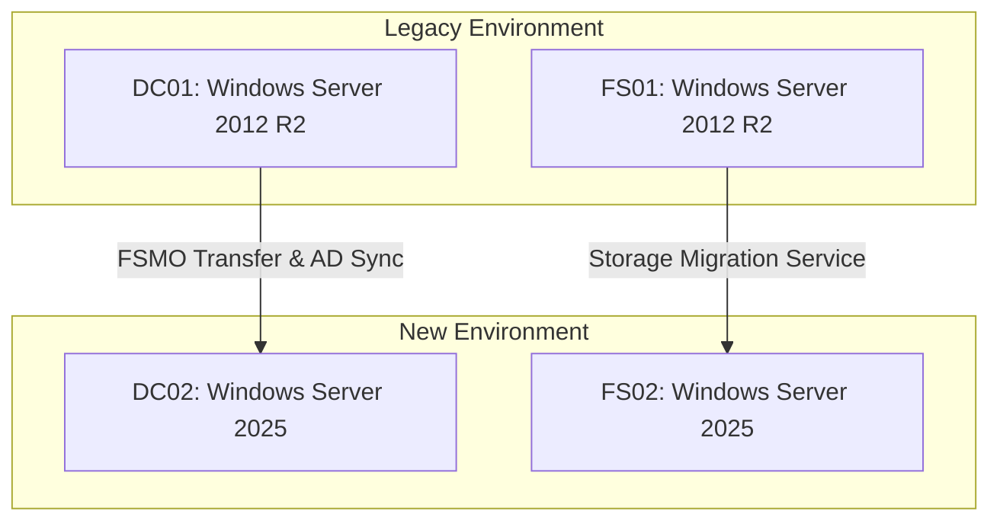

# Overview
A mid-sized enterprise client required an immediate OS lifecycle upgrade for their core infrastructure due to Windows Server 2012 and 2012 R2 reaching End of Support. The project involved standing up new Windows Server 2025 virtual machines, migrating Active Directory roles, and moving file shares with zero data loss and minimal downtime.

## Client Requirement
*   Upgrade Active Directory Forest and Domain functional levels to modern standards.
*   Migrate 4 TB of corporate data retaining all NTFS permissions and shares.
*   Ensure minimal disruption to end users during the final cutover window (weekend).
*   Decommission the legacy 2012 physical servers securely.

## Environment Details
*   **Source:** 2x Physical Dell PowerEdge Servers running Windows Server 2012 R2 (DC01, FS01).
*   **Destination:** 2x Virtual Machines running Windows Server 2025 on Azure Stack HCI (DC02, FS02).
*   **Key Services:** Active Directory Domain Services (AD DS), DNS, DHCP, File and Storage Services.

## Architecture Diagram


## Pre-Migration Checklist
- [x] Verified full bare-metal backups of DC01 and FS01.
- [x] Confirmed AD replication is healthy (`repadmin /showrepl`).
- [x] Validated Windows Server 2025 licensing and CALs for the new environment.
- [x] Scheduled an 8-hour maintenance window for the final cutover.

## Step-by-Step Implementation

### Phase 1: Active Directory Preparation and Promotion
1. Deployed the Windows Server 2025 VM (DC02) and joined it to the existing domain.
2. Installed AD DS and DNS server roles via Server Manager.
3. Promoted DC02 to a Domain Controller.
4. Allowed 24 hours for full initial AD replication and monitored event logs.

### Phase 2: FSMO Role Transfer
1. Transferred all 5 FSMO roles from DC01 to DC02.
2. Verified the new role holder using `netdom query fsmo`.
3. Updated DHCP scopes on the network edge router to hand out DC02 as the primary DNS server.

### Phase 3: File Server Migration (Using Storage Migration Service)
1. Deployed Windows Admin Center and installed the Storage Migration Service extension.
2. Created a new job targeting FS01 as the source and FS02 as the destination.
3. Completed the initial data sync (4 TB) over 3 days during business hours (background sync).
4. Executed the final delta sync and cutover during the scheduled maintenance window. FS02 assumed the identity (Name/IP) of FS01 seamlessly.

### Phase 4: Decommissioning
1. Demoted DC01 cleanly using Server Manager.
2. Removed DC01 from the domain and shut down the legacy physical hardware.
3. Raised Domain and Forest Functional Levels to Windows Server 2025.

## Commands / Scripts Used

```powershell
# Verify AD replication health prior to any changes
repadmin /replsummary

# Transfer all 5 FSMO Roles to the new Server 2025 Domain Controller
Move-ADDirectoryServerOperationMasterRole -Identity "DC02" -OperationMasterRole SchemaMaster, DomainNamingMaster, PDCEmulator, RIDMaster, InfrastructureMaster

# Verify FSMO Holders post-transfer
netdom query fsmo

# Raise Forest Functional Level to Server 2025
Set-ADForestMode -Identity "contoso.com" -ForestMode Windows2025Forest
```

## Issues Encountered
| Issue | Trigger/Symptom | Impact |
| :--- | :--- | :--- |
| **SYSVOL Replication Failure** | The legacy environment was still using FRS instead of DFSR for SYSVOL. Windows Server 2025 requires DFSR. | High - DC02 could not replicate group policies. |

### Resolution Steps
*   **SYSVOL Replication Failure:** Paused the promotion of DC02. Ran the `dfsrmig` tool on DC01 to migrate SYSVOL from FRS to DFSR (progressing through States 0 through 3). Once DC01 reached the "Eliminated" state for FRS, we successfully resumed and completed the DC02 promotion.

## Validation / Testing
*   Ran `dcdiag /c /v` on DC02 - all core tests passed.
*   Created a test service account in AD and verified it replicated to all sites securely.
*   Verified randomly selected end-users could map drives to the file server and effective access (NTFS permissions) remained intact.
*   Verified DHCP scopes were correctly assigning the new DNS IP configurations to endpoints upon lease renewal.

## Final Outcome
*   The migration completed within the 8-hour window with no unplanned downtime for end users.
*   Modernized the infrastructure to take advantage of the advanced security capabilities and performance improvements of Server 2025.
*   Legacy hardware was decommissioned safely and prepped for recycling.

## Lessons Learned
*   **Pre-flight checks:** Always manually verify whether FRS or DFSR is in use on older 2012 environments before attempting to introduce modern Domain Controllers, as FRS is strictly deprecated.
*   **Sync time:** The Storage Migration Service is highly effective, but the initial inventory of millions of small files took longer than anticipated. Start the inventory phase even earlier next time.

## References
*   [Storage Migration Service overview](https://learn.microsoft.com/en-us/windows-server/storage/storage-migration-service/overview)
*   [Migrate SYSVOL from FRS to DFSR](https://learn.microsoft.com/en-us/windows-server/storage/dfs-replication/migrate-sysvol-to-dfsr)
